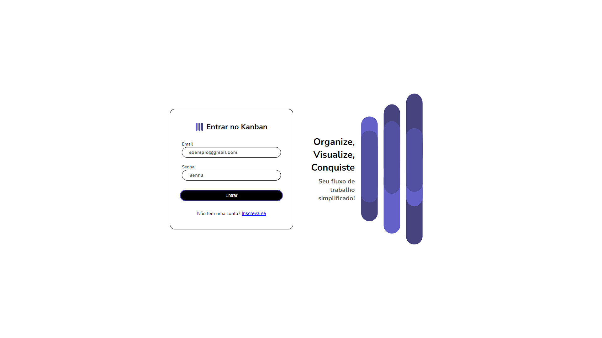
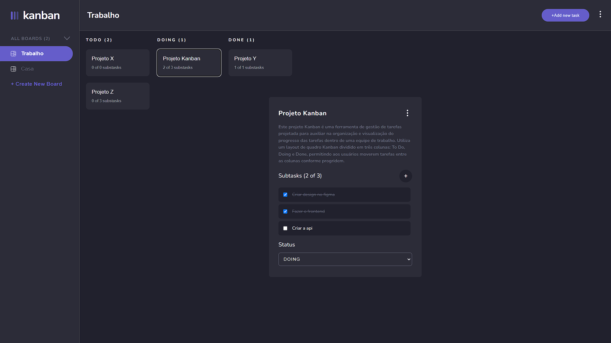
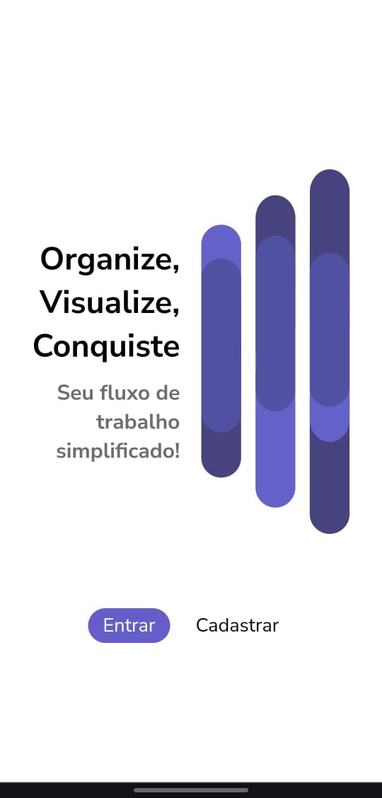
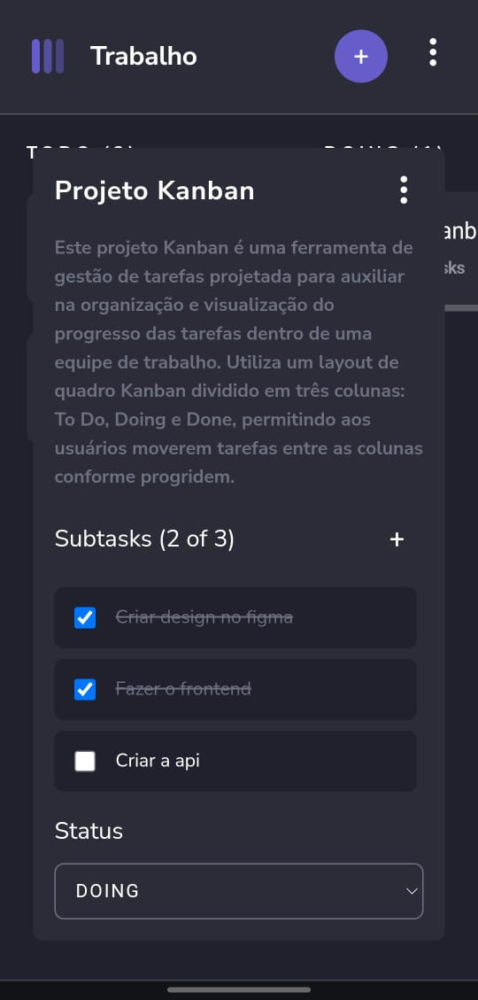

# Projeto Kanban

## Descrição

Este projeto Kanban é uma ferramenta de gestão de tarefas projetada para auxiliar na organização e visualização do progresso das tarefas dentro de uma equipe de trabalho. Utiliza um layout de quadro Kanban dividido em três colunas: To Do, Doing e Done, permitindo aos usuários moverem tarefas entre as colunas conforme progridem.  
Além das funcionalidades mencionadas, o Projeto Kanban foi desenvolvido com uma abordagem responsiva, garantindo uma excelente usabilidade tanto em desktops quanto em dispositivos móveis. Isso permite que os usuários gerenciem suas tarefas de maneira eficiente e confortável, independente do dispositivo que estejam utilizando. A interface adaptativa e intuitiva facilita a navegação, acesso e manipulação das tarefas em telas de todos os tamanhos.  

Disponível em https://kanban-livid-seven.vercel.app/  

## Funcionalidades

- **Criação de Tarefas**: Usuários podem adicionar novas tarefas ao quadro na coluna "To Do".
- **Gestão de Progresso**: Tarefas podem ser movidas entre as colunas "To Do", "Doing" e "Done" para representar o progresso atual.
- **Visualização de Subtarefas**: Cada tarefa pode conter várias subtarefas, que ajudam a quebrar tarefas maiores em partes menores e gerenciáveis.

## Ferramentas Utilizadas

- **Frontend**: React com Styled-Components.
- **Backend**: Node.js, Express e Mongoose.
- **Banco de Dados**: MongoDB Atlas.

## Como Usar

1. **Criar uma Conta ou Fazer Login**:
   - Acesse a página inicial do Projeto Kanban.
   - Se for um novo usuário, selecione "Increva-se" e preencha os detalhes necessários para se registrar.
   - Se já possui uma conta, apenas insira seu email e senha para fazer login.

2. **Adicionar uma Nova Tarefa**:
   - Após estar logado, clique no botão '+Add new task' no canto superior direito do quadro.
   - Preencha as informações necessárias da tarefa e adicione ao quadro.

3. **Mover Tarefas**:
   - Clique na tarefa e então selecione o "Status" da tarefa.

4. **Visualizar/Editar Subtarefas**:
   - Clique em uma tarefa para abrir e visualizar/editar suas subtarefas.

---
